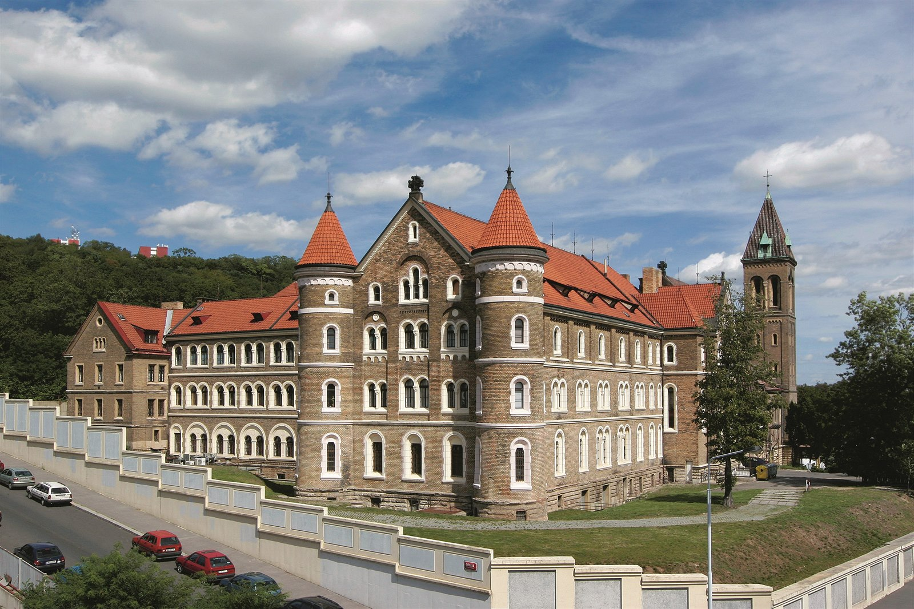
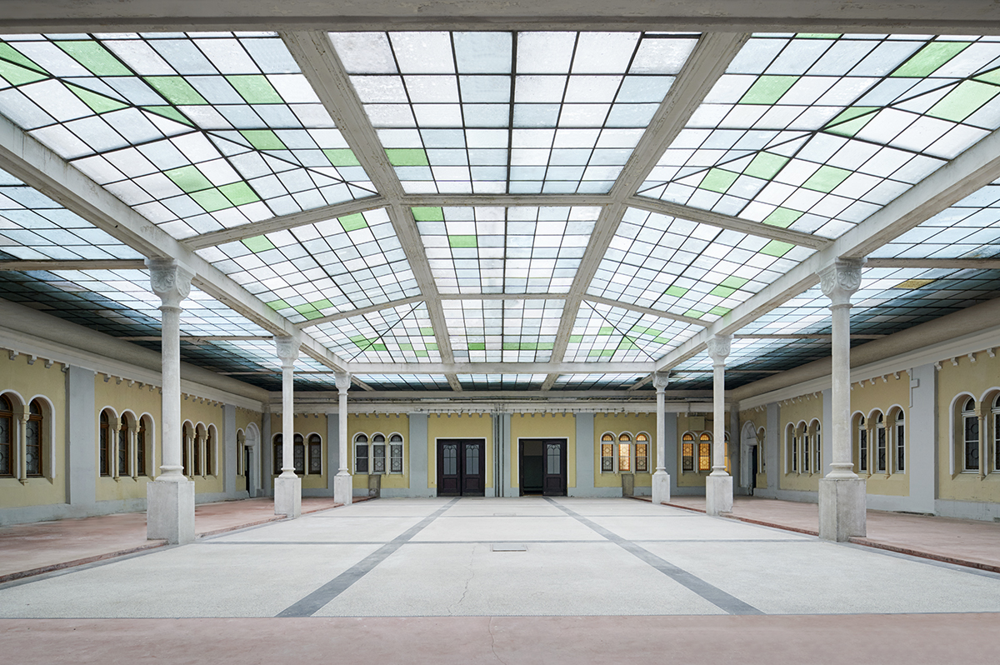
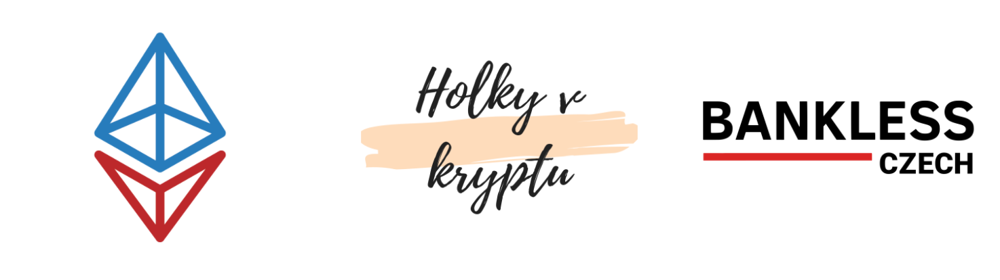

# Co je to UTXO.22?


🚧 Toto je pracovní dokumentace. Konference a její jméno zatím nebylo oficiálně oznámeno. Berte veškeré zde uvedené informace s rezervou.


[UTXO.22](http://utxo.cz) (/juː-tiː-ɛks-əʊ.22/) je otevřená komunitní konference zaměřená na kryptoměny a blockchain, která má ambice stát se **největší akcí svého druhu v České republice**. **** Jedná se o dvoudenní akci, která kombinuje aktuální krypto témata, aniž by se zaměřovala na jeden konkrétní blockchain.

Díky rozsáhlému programu, který obsahuje více než **100 hodin přednášek a workshopů**, můžeme nabídnout obsah jak široké veřejnosti, tak pokročilým uživatelům.


V současnosti máme potvrzených [15+ přednášejících](prednasejici.md), mezi ty nejvýznamnější patří, např. **Juraj Bednár**, **Mario Havel** nebo **Petr Mára**.


Naším cílem je představit a vzdělávat širokou krypto-veřejnost v oblasti otevřených blockchainů, jejich základních principů, jako je **decentralizace, neutralita, otevřenost, spolupráce** a souvisejících témat. Ukázat výhody, představit případy použití a zároveň prohloubit důvěru v jejich používání s důrazem na bezpečnost.

Velkým přínosem konference bude **propojení veřejnosti s širší kryptoměnovou komunitou** a zároveň **propojení jednotlivých komunit mezi sebou**, protože ty mají často tendenci mít oddělený obsah, akce a také publikum.

V neposlední řadě je program cíleně naplánován tak, aby navazoval na další významné krypto a související akce v regionu, a nabízí tak vhodnou zastávku jak pro přednášející, tak pro posluchače. **Konference je jednou z hlavních součástí iniciativy** [**Prague Crypto Days**](crypto-days/prague-crypto-days-22.md), která se bude konat v Praze 3.-12. června - její součástí bude například i mezinárodní hackathon [ETHPrague](https://ethprague.com) (10-12. červen 2022).

 

## Koncept konference

[Hlavní program](hlavni-program.md) se uskuteční o víkendu **4. a 5. června 2022** v unikátním komplexu bývalého kláštera v centru Prahy ([Gabriel Loci](misto-konani/)). **Optimální kapacita bude 1000 hostů** (maximum 1200) a zároveň plánujeme nabídnout konferenci online (live streaming), což by mělo znásobit její dopad.

K dispozici bude [hlavní přednáškový sál](misto-konani/prehled-salu/rajska-zahrada.md) s kapacitou 350 osob, dva středně velké přednáškové sály s celkovou kapacitou 320 osob a 4 menší sály pro workshopy s celkovou kapacitou 200 osob. Obsah v nich bude probíhat současně.&#x20;

V budově nabídneme také několik dalších prostor pro výstavu a charitativní aukci uměleckých děl NFT, prostory s výukovými materiály a praktickými ukázkami, bitcoinové bankomaty a samozřejmě občerstvení a prostory pro networking a odpočinek.

Venkovní část budovy poskytne přibližně 150 míst k sezení a širší prostor pro networking s možností využití několika food trucků. Večer po prvním dni konference bude následovat [společenský večer](doprovodny-program/kulturni-vecer.md) se zábavným programem a charitativní aukcí, na kterou plynule naváže [hudební a taneční párty](doprovodny-program/utxo.party.md) v několika sálech a různými žánry.

Vstupné nebude zdarma, ale chceme ho držet [velmi nízko](navstevnici/vstupenky.md#distribucni-faze). Na celou dvoudenní konferenci by vstupenka měla stát okolo $25 (cca 560 Kč).

Konference plánována jako čistě nezisková událost, která bude financovaná především sponzorskými dary. V současné době probíhá proces založení [nezávislého neziskového subjektu](organizacni-team/legalni-entita.md), který bude konferenci zaštiťovat.

Kromě hlavní konference proběhne pod naší záštitou, nebo v režii partnerských organizací několik menších akcí. V naší režii například promítání filmů s krypto tematikou, různé workshopy, krypto hospodské kvízy a podobně (viz. [Doprovodný program](doprovodny-program/)).

## Kdo jsme?

Jsme spolek sdružující několik českých kryptokomunit, které se věnují vzdělávání v oblasti blockchainu a kryptoměn.

Česko-slovenskou komunitu okolo Etherea a DeFi [**Gwei.cz**](https://gwei.cz) & [**BohemianDAO**](http://bohemiandao.cz), **** místní pobočku [**Bankless Czech**](https://bankless.cz) **** a organizace [**Holky v Kryptu**](https://holkyvkryptu.cz)**,** podporující a pořádající akce a aktivity zaměřené na oslovení začínajících a mírně pokročilých uživatelů.

V letošním roce jsme mimo jiné uspořádali největší venkovní [Krypto meetup v Brně](https://www.facebook.com/events/moravsk%C3%A9-n%C3%A1m%C4%9Bst%C3%AD-602-00-brno-%C4%8Desk%C3%A1-republika/krypto-meetup-v-brn%C4%9B/735915783871565/) (22.6.2021) s více než 600 návštěvníky a konferenci [ETHBrno](https://ethbrno.gwei.cz/predchozi-rocniky/2021) (9.10.2021) s 200 návštěvníky. Obě akce byly zdarma.

## Otevřenost a transparentnost

Je pro nás důležité, aby každý měl možnost říci svoje připomínky nebo nápady. Vytvořili jsme pro to vlastní [**Discord server**](https://discord.gg/5k9dEtVhnv) a veřejnou [**Telegram skupinu**](https://t.me/utxocz)**.** Budeme rádi pokud se zapojíte se do naší komunity.

Veškeré informace o konferenci se snažíme transparentně publikovat v rámci [Dokumentace](https://app.gitbook.com/o/-MX51JfmlnAQkYbTRI4J/s/ksSw74pkYApxPGDhzkzg/). Její součástí budou postupně všechny klíčové informace - například lidé, kteří se podílejí na organizaci ([Organizační team](organizacni-team/)), seznam subdodavatelů, nebo detailní rozpočet. Dokumentace je dostupná jako open-source na [GitHubu](https://github.com/gweicz/utxo22-docs), kde ji může kdokoliv pomoci doplnit, nebo opravit.

## Současný stav

Máme rezervované místo konání a potvrzené první [sponzory](sponzori.md) a [přednášející](prednasejici.md). Ve výrobě jsou také  [stránky konference](propagace/webove-stranky.md), které by měli být v základní verzi hotové s oficiálním oznámení konference na začátku ledna. První vlna vstupenek je očekávána během února. Další zásadní milníky, které nás čekají, naleznete na stránce [Roadmap](roadmap.md).

## Kde nás najdete

* Web: [utxo.cz](https://utxo.cz)
* Twitter: [@utxocz](https://twitter.com/utxocz)
* Discord: [discord.gg/5k9dEtVhnv](https://discord.gg/5k9dEtVhnv)
* Telegram: [t.me/utxocz](https://t.me/utxocz)
