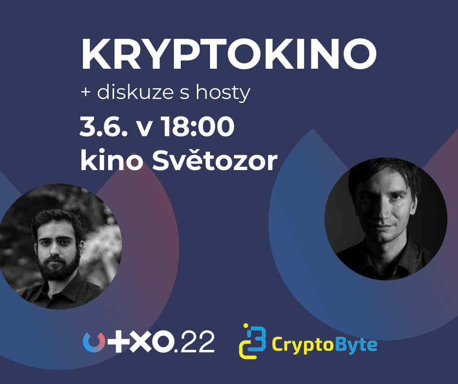

# KryptoKino 3.6.

V rámci širšího záběru konference, chceme nabídnout i různý doprovodný obsah a jedním z nich je i promítání prvního slovensko-českého dokumentárního filmu o kryptoměnách s názvem [Libertas](https://www.csfd.cz/film/926287-libertas/) (2020). Promítání se uskuteční v **pátek 3. června 2022** večer v [kině Světozor](utxo.kino.md#kino-svetozor-velky-sal). Po filmu bude následovat debata s hosty.

Vstupenky bude možné zakoupit v předprodeji společně se vstupenkou na UTXO.22 (max 100 míst), nebo poté skrz běžný prodejní systém kina (duben-květen).

Tuto událost pro vás připravujeme společně s libereckou konferencí [CryptoByte](https://cryptobyte.cz).

* Začátek promítání v 18:00.
* Délka filmu: 63 minut.&#x20;
* Následná diskuze a zakončení programu v cca 20:30.

👉 [Facebook událost](https://www.facebook.com/events/1349383142245910/)

| Kdy a kde                                | Film                                                                 | Popis                                                               |
| ---------------------------------------- | -------------------------------------------------------------------- | ------------------------------------------------------------------- |
| 
Pátek 3.6. 18:00 Kino Světozor
 | [Libertas](https://www.csfd.cz/film/926287-libertas/prehled/) (2020) | 
slovensko-český dokument Hosté: Juraj Bednár, Mario Havel
 |

## **Kino Světozor** - velký sál

* Web: [https://www.kinosvetozor.cz/](https://www.kinosvetozor.cz)
* Kapacita: 356 míst / představení

.jpeg>)

## Organizátoři

* [Dušan Kmetyo](https://twitter.com/DusanKmetyo) ([CryptoByte](https://cryptobyte.cz))
* [UTXO.22 Team](../organizacni-team/)
